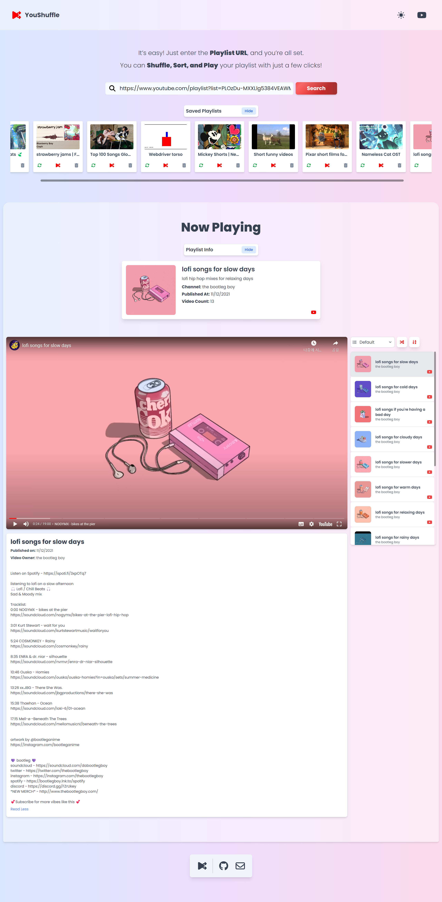
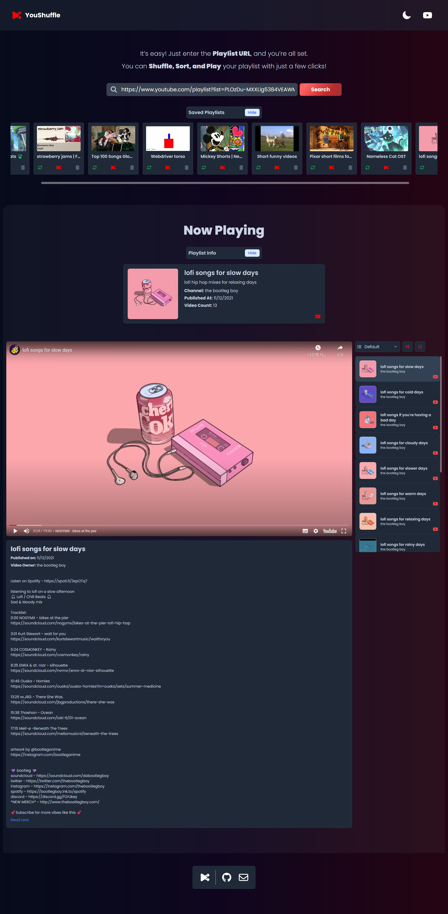
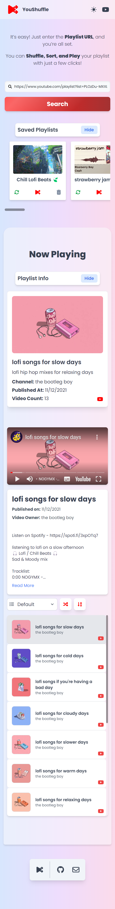
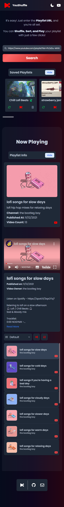

# YouShuffle


YouShuffle is a React app that lets you manage and play YouTube playlists. Simply enter a playlist URL, and the app fetches the videos, allowing you to shuffle, sort, and play them directly within the app. While YouTube's shuffling feature can sometimes be unpredictable, YouShuffle enhances this experience by offering a more consistent and user-friendly way to shuffle your playlists. It also caches playlists for quick access, making it a convenient tool for managing your YouTube playlists more effectively.

## Screenshots

### Desktop
<div style="display: flex; justify-content: space-between;">
  
  
</div>

### Mobile
<div style="display: flex; justify-content: space-between;">
  
  
</div>

## Getting started

1. Create the project.

   ```bash
   npx degit jwnle31/YouShuffle my-app
   ```

2. Access the project directory.

   ```bash
   cd my-app
   ```

3. Initialize a git repository.

   ```bash
   git init
   ```

4. Install dependencies.

   ```bash
   npm install
   ```

5. Start dev server with hot reload at http://localhost:3000.
   ```bash
   npm run dev
   ```

## Recommended VS Code extensions

- [ESLint](https://marketplace.visualstudio.com/items?itemName=dbaeumer.vscode-eslint)
- [Prettier](https://marketplace.visualstudio.com/items?itemName=esbenp.prettier-vscode)

## Other commands

### Lint commands

```bash
npm run lint
```

### Build commands

```bash
npm run build
```
